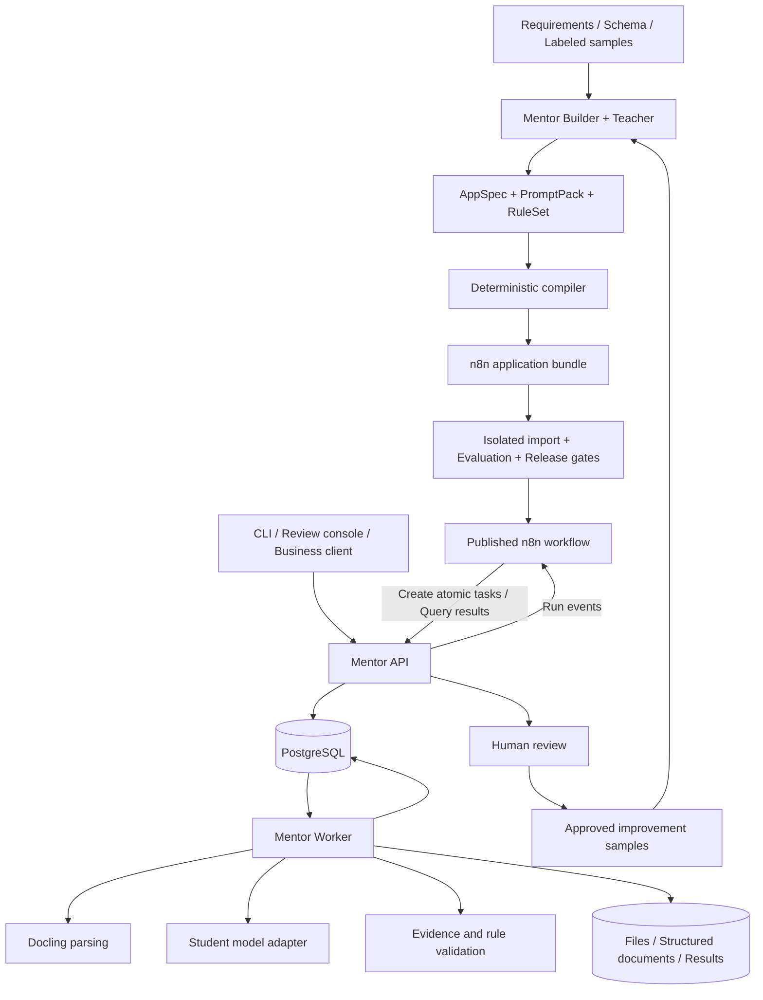

# Mentor

[简体中文](README.md) | [English](README.en.md)

**Use stronger models to design and improve applications, and lower-cost models to run them reliably.**

Mentor turns business requirements, document samples, and acceptance rules into AI workflows that can be verified, deployed, and continuously improved. The first release focuses on **document extraction and validation using n8n + Docling**. A separate adapter will add Dify support later.

> This document is the technical baseline for implementation, updated on 2026-09-20. The repository currently contains the design and license only. The modules, directories, APIs, commands, and performance targets below are planned; they have not been implemented or benchmarked. Deliver each milestone in sequence and update this document with the actual supported scope, versions, and operating instructions.

Navigation: [Product scope](#1-product-goals-and-initial-scope) · [Architecture](#3-architecture-and-responsibilities) · [Application contract](#4-appspec-a-compilable-application-contract) · [Reliable execution](#7-n8n-integration-and-reliable-execution) · [Evaluation gates](#9-evaluation-costs-and-release-gates) · [API design](#10-data-model-and-api-contracts) · [Implementation plan](#15-milestones-and-definition-of-done).

## 1. Product Goals and Initial Scope

### 1.1 The Problem

Asking a model to read an entire file and return JSON rarely provides accuracy, cost control, traceable evidence, and failure recovery together. Mentor divides the task into verifiable steps: parse the document, locate relevant content, extract fields, verify evidence, apply business rules, and handle exceptions. Configurations that pass evaluation become versioned applications.

“Stronger” and “weaker” describe a model's capability and cost for a particular task. Evaluation determines these roles, rather than parameter count or brand. The stronger model is the **Teacher**; the model used for routine execution is the **Student**.

### 1.2 First Reference Application: Purchase Order Extraction and Validation

Purchase orders provide a reference template for validating header fields, line-item tables, monetary relationships, and evidence across pages. Schemas extend the underlying extraction capabilities to other document types.

| Dimension | v0.1 scope |
| --- | --- |
| Users | Single-organization deployment; developers configure applications, and operators upload and review documents |
| Input | One PDF or PNG/JPEG file; digital PDFs first, followed by clear Chinese and English scans |
| Default limits | Up to 20 pages and 20 MiB per document; configurable limits, enforced before queueing |
| Header fields | Order number, order date, buyer, seller, currency, and order total |
| Line items | Item name, quantity, unit, unit price, and line amount; optional discounts, shipping charges, and tax amounts |
| Validation | Types, required fields, evidence locations, monetary precision, line and total relationships, and field conflicts |
| Output | Business JSON, field evidence, rule reports, execution costs, and review status; traceable original output and revisions |
| Integration | Standard n8n workflow JSON that calls Mentor Runtime and Docling parsing capabilities |
| Human actions | Accept, correct, or reject, with access to the corresponding pages and source evidence |

The first release does not guarantee handwriting recognition or universal format support, and excludes cross-document reconciliation, unrestricted web crawling, automatic writes to business systems, multitenant billing, and a custom drag-and-drop canvas. DOCX, complex mixed layouts, document question answering, and Dify are deferred. Unrecognizable documents and inapplicable rules must produce explicit states; the system must not invent fields or treat unchecked conditions as passed.

### 1.3 User Workflow

1. Provide business goals, field definitions, rules, and a small set of redacted samples.
2. The Teacher proposes application specifications, extraction prompts, examples, and rules, and lists unresolved business questions.
3. The user confirms field meanings, monetary calculation conventions, missing-value handling, and acceptance targets, creating an immutable specification revision.
4. The compiler generates an n8n workflow and runtime configuration, imports them into an isolated environment, and runs evaluation.
5. A version is released after it meets quality, cost, and operational gates. The Student processes routine documents.
6. Difficult cases enter human review. Approved corrections become samples for the next offline optimization cycle.

The first release implements **optimization of prompts, examples, task decomposition, and policies**. Fine-tuning and weight distillation remain future options, not initial dependencies.

## 2. Core Architecture Decisions

| Decision | Approach | Rationale and constraints |
| --- | --- | --- |
| First platform | n8n + Docling | Complete a usable document-processing workflow with deterministic business branches before adding Dify |
| Build process | Teacher produces a constrained `AppSpec`; code compiles the workflow | Code ensures node structure, variable references, and error paths; the model cannot generate arbitrary executable code |
| Execution boundary | n8n advances the workflow; Mentor owns atomic capabilities, domain state, and evaluation | Keep native workflows readable without scattering rules across platform expressions |
| Document source of truth | Original file + Docling JSON + Mentor's normalized document | Markdown serves prompts and previews; structured data governs evidence and table structure |
| Quality priority | Hard rules and evidence checks first; model scores are supplementary | Valid JSON and self-reported confidence do not establish business correctness |
| Model policy | Offline Teacher, online Student; online Teacher disabled by default | Measure the Student's capabilities before enabling budgeted escalation for difficult cases |
| System structure | Modular Python monolith with separate API and Worker processes | Share types and business logic while isolating parsing workloads; avoid premature microservices |
| Initial persistence | PostgreSQL + local persistent volumes | Reduce deployment components; reserve an S3 storage interface for later multi-host deployment |
| Task processing | Durable PostgreSQL task table; n8n in regular execution mode | Workers execute atomic tasks, not a second DAG engine; Redis is unnecessary initially |
| Frontend | Lightweight review console; reuse the n8n canvas | Prioritize uploads, evidence inspection, human corrections, and run queries |
| Release policy | Immutable application bundles, environment bindings, real import verification, and rollback | Generating a file does not prove that its workflow can run |

## 3. Architecture and Responsibilities



### 3.1 Control Plane: Design, Compile, Evaluate, Release

- **Builder** turns requirements and samples into candidate specifications, recording assumptions, open questions, and reasons for changes.
- **Spec Validator** checks schemas, task graphs, rule parameters, budgets, and target platform capabilities.
- **Compiler / Target Adapter** generates platform artifacts from tested templates without making model calls.
- **Evaluator / Optimizer** runs fixed datasets, attributes failures, and proposes a bounded set of improvements.
- **Registry / Release** stores immutable bundles, evaluation results, and environment bindings, and manages the active release pointer.

Deployed applications do not require the Builder, optimizer, or Teacher to be available online.

### 3.2 Runtime Plane: Ingestion, Atomic Tasks, Results, and Review

- **API** handles authentication, file ingestion, application version selection, run queries, task interfaces, and human revisions.
- **n8n** executes the compiled business graph, chooses execution order and branches, invokes atomic capabilities, and waits for completion.
- **Worker** executes tasks such as `parse`, `extract`, and `validate`, maintaining leases, retry counts, and call records.
- **PostgreSQL** is the authoritative source of business state. n8n uses a separate database and database user; Mentor does not access n8n's internal tables.
- **ArtifactStore** holds originals, parsed documents, page images, evaluation artifacts, and results. n8n passes only IDs and small status payloads.

`Run.status` describes the document-processing outcome; `n8n execution status` describes platform execution. A workflow can finish successfully while its business outcome is `needs_review`. Both must be displayed separately.

## 4. AppSpec: A Compilable Application Contract

### 4.1 Contract Contents

`AppSpec` is the single source of business semantics. It is written in YAML, validated with Pydantic, and serialized into canonical JSON. Schema, business application, compiler, and target platform versions are managed separately.

| Component | Required information |
| --- | --- |
| Identity | `schema_version`, `app_id`, `app_version`, description, and revision provenance |
| Input | Document formats, languages, size/page limits, and document type |
| Output | JSON Schema, field explanations, precision, normalization policies, and missing-value semantics |
| Document policy | Parsing configuration, chunking, evidence location, and long-table handling |
| Model policy | Logical roles, required capabilities, context/output token budgets, and bounded repair/escalation |
| Rules | Rule IDs, types, field bindings, applicability conditions, parameters, and severity |
| Workflow | Typed nodes and edges, termination conditions, task timeouts, and error routing |
| Evaluation | Dataset version, metric definitions, thresholds, and cost comparison methodology |
| Deployment | Target platform, compatibility profile, and required connection names; no credential values |

The following illustrates the **configuration shape, not a complete executable specification**. An actual specification also requires the output schema, PromptPack, rule definitions, and typed task graph.

```yaml
schema_version: "0.1"
app_id: purchase_order_extractor
app_version: "0.1.0"
target: n8n
input:
  formats: [pdf, png, jpeg]
  languages: [zh, en]
  max_pages: 20
  max_file_bytes: 20971520
document:
  parser_profile: standard_ocr
  preserve_tables: true
  evidence_required: true
models:
  teacher: teacher_default
  student: student_default
policy:
  missing_value: null
  max_student_repairs_per_step: 1
  max_teacher_escalations_per_run: 0
  max_model_requests_per_run: 24
  max_run_seconds: 600
rules:
  - id: line_amount_consistency
    type: decimal_product_equals
    fields: [items.quantity, items.unit_price, items.line_amount]
    rounding: half_up
    tolerance_minor_units: 1
    severity: error
evaluation:
  dataset: purchase_orders_v1
  min_critical_field_accuracy: 0.98
  min_auto_accept_precision: 0.99
  max_review_rate: 0.20
```

### 4.2 Supported Logical Nodes

The initial logical graph permits only `document.parse`, `document.select`, `llm.extract`, `rules.validate`, `quality.route`, `review.create`, and `result.finalize`. The main data-processing graph is a DAG. Repair and waiting use explicitly bounded template subflows; arbitrary recursion and dynamic tool selection are excluded.

Each node declares input/output types, preconditions, timeouts, and failure codes. `llm.extract` can reference only registered PromptPacks, schemas, and model roles. Rules can call only deterministic operators in the registry. User text must not become Python, JavaScript, SQL, or n8n expression code.

### 4.3 Compilation Pipeline

```text
AppSpec + PromptPack + RuleSet
  -> Syntax and type validation
  -> Normalized execution plan (ExecutionPlan)
  -> Target platform capability checks
  -> Template expansion and variable binding
  -> n8n workflow.json + runtime-config.json + manifest.json
  -> Static checks -> Real import -> Smoke tests -> Evaluation -> Releasable bundle
```

ExecutionPlan is a compiler intermediate representation for Mentor's supported semantics. It does not attempt to cover every n8n or Dify feature. An unsupported node must produce an error with its ID, missing capability, and suggested resolution; silent removal or degradation is prohibited.

The compiler checks unique node IDs, unresolved references, type compatibility, termination of all branches, valid template expressions, enforceable call limits, and complete credential placeholders. Identical inputs, compiler versions, and target profiles must produce identical content hashes. Timestamps belong in build records, outside canonical artifacts.

## 5. Document Parsing, Extraction, and Evidence

### 5.1 Ingestion and Parsing

1. Upload through the Mentor API. Validate file signatures, extensions, byte size, page count, and access permissions. Return explicit errors for encrypted PDFs, corrupt files, and oversized inputs.
2. Store the original in ArtifactStore and record its SHA-256 hash. Content may be reused within the same organization, and the same file may be rerun against different application versions.
3. Parse with Docling inside a resource-constrained Worker, preserving text, tables, reading order, and available page/location information.
4. Store both full Docling JSON and Mentor `DocumentIR`; Markdown is a derived view. Docling JSON preserves table spans that Markdown cannot represent equivalently. See the [official serialization documentation](https://docling-project.github.io/docling/concepts/serialization/).
5. Record parsing status, page count, actual OCR engine/languages, model resource versions, duration, and page-level anomalies. Failed parsing or missing pages must not proceed to automatic acceptance as a complete document.

Use a PDF's text layer where possible and enable OCR when necessary. Scans use OCR configurations validated on Chinese and English samples. Docling supports multiple inputs and configurable conversion, but format handling and OCR quality must still be verified against the project's dataset. See the [document converter reference](https://docling-project.github.io/docling/reference/document_converter/).

### 5.2 DocumentIR and the Evidence Contract

`DocumentIR` contains `document_id`, the original file hash, parser configuration hash, version, pages, paragraph blocks, tables, and parsing warnings. The evidence contract includes:

| Field | Convention |
| --- | --- |
| `document_id` / `parse_id` | Pin the original and a specific parsing version, never “the latest parse” |
| `block_id` | Stable within one parsing version; may change after reparsing |
| `page` | One-based; `null` if the source has no page number; never fabricated |
| `bbox` | Optional; normalized to 0–1 coordinates with a top-left origin; retain original coordinates and transformation details |
| `text_span` | Unicode code-point offsets `[start, end)` within a text block, resolved server-side; the frontend must not slice directly by UTF-16 offsets |
| `table_cell` | Optional table ID, zero-based row/column indices, and spans |
| `quote` | Source excerpt, verified server-side against the resolved location |

The initial purchase-order application requires evidence locatable to a page and a text block or table cell. Missing required location information triggers review. The parser is not expected to provide identical geometric precision across all formats.

### 5.3 Chunking and Extraction

- Build structural blocks from headings, paragraphs, and tables, then chunk using the Student's actual tokenizer and context budget. Reserve capacity for prompts, schemas, and output.
- Extract headers and line items in separate steps. Process line-item tables in row windows, repeating column headers and carrying table IDs, original row indices, and source block IDs.
- Merge tables across pages only when column structure and continuation evidence agree; otherwise preserve the conflict. Deduplicate by source location, not item name, so legitimate repeated items remain.
- Initially select content using rules and document structure. If no match is found, scan remaining blocks within the total budget. Do not introduce a vector database. Budget exhaustion or truncation must produce an incompleteness flag.
- The Student returns business fields and evidence references. Without supporting source content, return `null` and a reason; do not invent order numbers, currencies, dates, or amounts.

Each application records its normalization policy: do not guess ambiguous dates or infer currency from language alone. Represent amounts as decimal strings with an explicit currency; rules specify decimal places and rounding.

### 5.4 Result Format

Separate business values from field metadata so downstream consumers do not need to traverse complex wrappers. The following is an abbreviated example; the application defines the complete schema.

```json
{
  "run_id": "run_example",
  "app_version": "0.1.0",
  "result_revision": 1,
  "status": "needs_review",
  "data": {
    "order_number": "PO-2026-001",
    "currency": null,
    "total_amount": "1280.00"
  },
  "field_meta": {
    "/total_amount": {
      "state": "extracted",
      "evidence": [{
        "document_id": "doc_example",
        "parse_id": "parse_example",
        "block_id": "block_42",
        "page": 2,
        "quote": "Total 1280.00"
      }]
    },
    "/currency": {
      "state": "not_found",
      "evidence": []
    }
  },
  "validation": [{
    "rule_id": "currency_required",
    "status": "fail",
    "field_paths": ["/currency"],
    "message": "No currency evidence found; human review required"
  }]
}
```

`field_meta` keys use JSON Pointer. Field states include `extracted`, `not_found`, `unreadable`, `conflict`, `derived`, and `human_corrected`. Missing amounts must not become zero. Derived fields record their `rule_id` and input-field lineage. Human corrections record the operator, reason, and revision; they must not masquerade as original model evidence.

## 6. Deterministic Validation and Exception Routing

### 6.1 Four Validation Layers

1. **Structure validation:** JSON must parse and satisfy its schema. Unknown fields and invalid types have explicit handling. Use strict validation rather than implicitly coercing arbitrary strings into valid amounts.
2. **Evidence validation:** References must belong to the current document and parsing version, source excerpts must be locatable, and normalized values must agree with the source. A resolvable citation proves location, not semantic correctness; rules and evaluation must also verify field meaning.
3. **Business validation:** Check required fields, enums, date formats, decimal arithmetic, and business constraints. Rule outcomes are `pass`, `fail`, `not_applicable`, or `unknown`.
4. **Quality routing:** Automatically accept only complete documents that pass every critical check. Route other outcomes to repair, review, or technical failure according to their cause.

The reference template's line-amount rule applies only where “quantity × unit price” is established. Discounts, taxes, shipping charges, and rounding conventions must be defined in the template. Calculate order totals only when all relevant components are available. Never alter extracted values to make an equation balance; return `unknown` for undefined calculation conventions.

### 6.2 Bounded Recovery

| Problem | Response | Limit and final outcome |
| --- | --- | --- |
| Invalid JSON / repairable formatting | Ask the Student to repair the output with structural errors included | At most 1 repair per extraction step; unresolved cases become `needs_review` |
| Field conflicts / missing critical evidence | Re-extract with targeted additional context, or send directly to review | Do not repeatedly send the entire document; enforce the global call budget |
| Unreadable OCR / incomplete parsing | Retain diagnostics and usable pages; route to review | Do not misclassify document structure problems as prompt problems |
| Model 429 / temporary 5xx | Honor Retry-After and use exponential backoff with jitter | At most 2 transport retries per logical call; the overall deadline takes precedence |
| Model 401 / unsupported parameters | Return a configuration error | No retries and no automatic switch to another data destination |
| Online Teacher escalation | Only for explicitly enabled applications and data permitted to leave the environment | Default 0; when enabled, at most 1 per run, subject to the same validation |
| Budget exhaustion | Stop new calls and preserve evidence and diagnostics | `needs_review` if a reviewable result exists; otherwise `failed` |

Student repairs, transport retries, and Teacher escalations all count toward `max_model_requests_per_run`, token budgets, and the cost ledger, preventing multiplicative retries across layers. Reserve budget atomically before each external request, including concurrent requests. If the provider does not return usage, mark the cost as estimated rather than zero.

The initial release does not use a model's self-reported 0–1 confidence for automatic acceptance. Any later quality score must be calibrated on an independent validation set and must not override critical rule failures.

## 7. n8n Integration and Reliable Execution

### 7.1 Standard Workflow

n8n supports workflow JSON import and export. Exports may contain credential names, IDs, or authentication information in HTTP parameters, so Mentor must inspect and sanitize artifacts independently. See the [official import/export documentation](https://docs.n8n.io/build/manage-workflows/export-and-import).

The generated canvas should expose the actual business steps:

```text
Authenticated Webhook (receives run_id and artifact_hash)
  -> Validate run bindings
  -> Create parse task -> Wait and query
  -> Create select task -> Wait and query
  -> Create extract task -> Wait and query
  -> Create validate task -> Wait and query
  -> Switch (pass / bounded repair / human review / technical failure)
  -> finalize or review.create
```

Use verified native node types such as Webhook, HTTP Request, If/Switch, and Wait, with pinned `typeVersion` values. Expand bounded repairs into template branches. The initial release does not depend on community nodes or hide the entire business workflow behind a single opaque HTTP node.

Docling operations and model calls run as asynchronous atomic tasks, with the API returning `task_id` immediately. n8n waits through a Wait-and-query loop, starting at 2 seconds and increasing to at most 10 seconds. Each iteration checks task status and the run deadline. Polling and transport retries are template behavior; indefinite waits are prohibited.

Production uses the published workflow's production Webhook. Test endpoints are reserved for isolated verification and must not be mixed with production endpoints. See the [n8n Webhook documentation](https://docs.n8n.io/integrations/builtin/core-nodes/n8n-nodes-base.webhook/). External callers upload documents and create runs through Mentor API, which returns `202` after persisting the request rather than waiting for document processing to finish.

### 7.2 Idempotency, Task Leases, and Recovery

- Write an outbox event in the same transaction that creates the run. A dispatcher retries delivery to n8n so accepted work is not lost if a process crashes after commit.
- Scope client idempotency keys to the organization, endpoint, and request-body hash. The same key and content return the existing resource; the same key with different content returns `409`.
- Deduplicate atomic tasks by `(run_id, logical_step_id, repair_round, input_hash)`. Duplicate Webhooks may traverse the canvas again, but completed tasks return their existing artifacts.
- Workers claim tasks in short PostgreSQL transactions using `FOR UPDATE SKIP LOCKED`. Do not hold transactions open during execution. Store leases, heartbeats, and monotonically increasing fencing tokens.
- Write task artifacts per attempt. Only the Worker holding the current lease and fencing token may commit results, preventing stale processes from overwriting newer results.
- Reclaim tasks after a crashed Worker's lease expires. A provider timeout may already have incurred charges, so external inference cannot be guaranteed exactly once. Keep ledger entries for both known and uncertain calls.
- Workers execute only the requested atomic step. The API validates step legality and prerequisite artifacts. n8n decides the next step; the task table does not schedule the business graph.
- A watchdog detects missing heartbeats, expired deadlines, and dispatched runs that never started. Retry entry delivery within a bounded limit and resume from existing atomic artifacts; otherwise terminate as `failed` with a reason.
- Persist cancellation, stop subsequent queueing and model calls, and prevent late results from marking the run successful. External requests that cannot be revoked immediately may still incur charges.

Write files to temporary locations and commit them atomically before creating valid database references. A cleanup job removes orphaned files after a retention period. Commit a run's final result, status change, and audit event in one transaction.

Parsing cache keys include the organization, original file hash, parser configuration, Docling/OCR versions, and model resource hashes. Model caches additionally include canonical input, PromptPack/schema hashes, the actual model ID, and generation parameters. Disable long-term reuse if model version stability cannot be established. Caches must not cross permission boundaries; cache hits still record provenance and the fact that no new model call occurred.

### 7.3 Human Review and Terminal States

```text
queued -> running -> succeeded
                  -> needs_review -> succeeded / rejected
                  -> failed
queued / running / needs_review -> cancelled
```

Store the current stage in `current_step` rather than expanding the run status enum. When a run enters `needs_review`, its n8n execution ends normally. Mentor persists the review queue instead of polling throughout human work that may take days.

Review submissions include `expected_result_revision`; conflicting concurrent revisions return `409`. Rerun relevant deterministic rules after corrections. Critical failures cannot be accepted directly. If an exception is necessary, an administrator records a separate override decision and reason, and the result is marked as manually accepted. It does not count toward automatic acceptance precision. Preserve the original model result and append a new final-result revision.

Rerunning a `failed`, `rejected`, or `cancelled` run creates a new run linked to the original. Release changes do not alter version bindings for runs already started. The initial release supports result queries and downloads; writes to external systems are deferred to later outbox-based, idempotent connectors.

Review creation and final submission are also protected by database uniqueness constraints and state transitions. Repeated terminal-node execution returns existing results rather than creating duplicate review items or result revisions.

## 8. Teacher Design and Offline Optimization

### 8.1 Build Inputs and Outputs

Builder receives business descriptions, human-defined field/rule constraints, redacted document summaries, and development-set samples. The Teacher may produce only candidate specifications, PromptPacks, example selections, and explanations within the constrained schema. It cannot change authentication, data egress policies, test sets, release gates, or runtime budget ceilings.

Outputs must explain field meanings, possible ambiguities, and unresolved business conventions. Questions such as currency provenance or total composition remain explicit open items if no definitive answer exists. Unresolved critical items block release.

### 8.2 Bounded Optimization Loop

1. Run the current Student application on a fixed development set and aggregate errors by field, language, template, and scan quality.
2. Distinguish parsing/location errors, omissions, incorrect extractions, type errors, business rule errors, and infrastructure failures. Prompt changes alone cannot resolve parsing problems.
3. The Teacher proposes localized changes to field descriptions, few-shot examples, table windows, context selection, or rules. Save each change's before/after diff and source sample IDs.
4. Candidates first pass compilation checks, then use the development set for iteration and the validation set for selection. Allow at most 3 rounds with at most 3 candidates per round within a fixed budget.
5. Meet quality gates before comparing cost and latency. Keep cost–quality comparisons for eligible candidates rather than hiding critical errors in a single weighted score.
6. Freeze the release candidate, then run acceptance evaluation once on the locked test set through an independent evaluation entry point. A failed test blocks release. If repeated improvements use the same test set, retire it into development data and obtain a new independent test set.

Teacher-generated labels are proposed annotations, not test ground truth. Production review results must be approved, redacted, deduplicated, and registered in a dataset version before entering a later optimization cycle. Production prompts must not be rewritten automatically.

## 9. Evaluation, Costs, and Release Gates

### 9.1 Dataset Construction

M0 collects at least 30 representative redacted documents for feasibility analysis. Before v0.1 acceptance, create a human-verified dataset of at least 500 documents, with a suggested split of 200 development, 100 validation, and 200 locked test documents.

Split by supplier or layout family. Originals, scan variants, similar templates, and synthetic samples derived from the same source must not leak across partitions. Dataset manifests record content hashes, document families, languages, scan properties, field values, evidence, expected rules, and human review requirements. Test slices must cover the main target scenarios; undersized slices support exploratory findings only.

Humans confirm test ground truth, with review and adjudication for critical amounts/identifiers and disputed evidence. Synthetic data may supplement edge cases, but must be labeled and reported separately and cannot replace real-document metrics.

### 9.2 Three Comparison Paths

| Path | Purpose |
| --- | --- |
| The same parsing/extraction workflow using Teacher for every model step | Establish a stronger-model quality and cost reference, not absolute ground truth |
| Unoptimized Student | Measure the starting point and determine whether Teacher optimization helps |
| Mentor-optimized Student with the fixed recovery policy | Validate the final application, including retries, escalations, and failures |

All three use the same files, schemas, rules, evaluator, and request configurations fixed in advance. Report runs with caches disabled separately from runs with caches enabled. Do not compare heavy cache reuse against a full-price baseline. Fixed parameters do not guarantee identical model outputs; important candidates must report variation across repeated runs.

Report Teacher optimization gains separately against the unoptimized Student. With no regression in critical quality, improve at least one preselected measure: accuracy, automatic acceptance coverage, or total delivery cost per document. If the change falls within repeated-run variation, mark the gain as unproven. A price difference from Teacher is not evidence of optimization effectiveness.

### 9.3 Metric Definitions and Initial Targets

The following are proposed v0.1 release targets, **not demonstrated performance commitments**. M0 establishes feasibility using representative samples, and definitions and thresholds are frozen before M1. Later changes must document their reasons, impact, and new baseline. Do not lower standards after seeing test results.

| Metric | Definition | Initial target |
| --- | --- | --- |
| Schema validity | Fraction of runs producing results whose final JSON satisfies the schema; also report validity of the raw first response | Final output: 100% |
| Critical-field accuracy | Exact match for critical fields across all inputs after defined normalization; failed or missing outputs count as errors | ≥ 98% |
| Line-item field quality | Field micro-F1 after human-established row alignment; duplicated, missing, and extra rows count as errors | ≥ 95% |
| Automatic acceptance precision | Fraction of automatically accepted documents with all critical fields, line items, and rules correct | ≥ 99% |
| Automatic acceptance coverage | Automatically accepted documents / all in-scope test documents | ≥ 80% |
| Human review rate | Documents first entering `needs_review` / all in-scope documents | ≤ 20% |
| Critical evidence validity | Fraction of critical-field evidence in automatically accepted results that is locatable and verified by annotations to support the value | 100% |
| Technical failure rate | Non-business-rejection `failed` runs / valid submissions, measured in a controlled environment with functioning model services | ≤ 1% |
| Average model cost | All model charges in the final path / submitted documents, compared on the same basis with Teacher | ≤ 50% of Teacher baseline |
| Digital PDF latency | p95 from submission to automatic result or review queue, for 1–10 pages at concurrency 2 with models and parsers warmed up | ≤ 180 seconds |
| Scanned PDF latency | Same methodology, reporting OCR separately | ≤ 300 seconds |

Report accuracy overall and by language, document family, and scan type. When many fields are absent, also report accuracy for fields whose source contains a value so nulls do not hide omissions. Automatic acceptance precision is a document-level measure, not an average over easy fields. Incorrectly accepting a test sample deliberately violating a critical rule blocks release.

Show numerators and denominators for all rates, with 95% confidence intervals for precision and accuracy. A 200-document test set supports initial empirical acceptance; it does not establish a 99% lower bound for production precision. During the pilot, continuously sample automatically accepted results for human review. Any confirmed critical false acceptance pauses automatic acceptance for that application and triggers rollback or full manual review.

Latency reports include actual CPU, memory, OCR configuration, model ID, region, concurrency, document page counts/resolution, and cold-start duration. Human waiting time is reported separately. The reference environment is Linux containers with 8 vCPU, 16 GiB memory, and external model APIs; M0 measurements determine resource requirements.

### 9.4 Cost Ledger

```text
Execution cost per document = Parsing cost + All model request costs + Allocated storage/runtime cost
Total delivery cost per document = Execution cost + Human review cost + Amortized build/optimization cost
Break-even document volume = Additional build cost / (Baseline delivery cost per document - Optimized delivery cost per document)
```

Use the break-even formula only when its denominator is positive and business accounting conventions match. Record model costs by input, output, and cached tokens using snapshots of actual provider prices. Self-hosted models include GPU time and utilization assumptions. Show Teacher design costs, evaluation costs, and human review time separately; a cheaper token price alone does not demonstrate lower total cost.

## 10. Data Model and API Contracts

### 10.1 Core Entities

| Entity | Key contents |
| --- | --- |
| `Application` / `AppRevision` | Logical application, immutable AppSpec, PromptPack, RuleSet, and content hashes |
| `Build` / `Artifact` | Specification revision, compiler/target versions, bundle hash, and static-check report |
| `DatasetVersion` / `Evaluation` | Dataset manifest and splits, model configuration, metrics, raw results, and costs |
| `Deployment` | Environment, bundle, n8n workflow ID, connection bindings, and release/rollback records |
| `Document` / `Parse` | Original, organization, hash, parser configuration, DocumentIR, and page-image references |
| `Run` / `StepTask` / `Attempt` | Pinned versions, status, deadlines, idempotency keys, leases, fencing tokens, and diagnostics |
| `ModelCall` | Model role/actual ID, usage, price snapshot, reserved budget, and estimated/actual status |
| `ResultRevision` / `Review` | Original and revised results, field changes, review decisions, operator, and reason |
| `OutboxEvent` / `AuditEvent` | Durable dispatch state and audits of configuration, status, and permission operations |

Although the initial deployment serves one organization, every business entity explicitly binds to `organization_id`, with access scope checked server-side. Application and result versions cannot be overwritten in place. Store timestamps in UTC and convert for display. Keep original binaries and large parsed content outside database JSON fields.

### 10.2 Public API (Planned)

| Method and path | Behavior |
| --- | --- |
| `POST /v1/documents` | Upload and validate multipart content; return `201` and `document_id` on success |
| `POST /v1/apps` | Create a logical application |
| `POST /v1/apps/{app_id}/revisions` | Submit and validate AppSpec; create an immutable revision |
| `POST /v1/builds` | Compile asynchronously from a revision and target profile; return `202` |
| `POST /v1/evaluations` | Evaluate a candidate bundle asynchronously on a specified dataset version |
| `POST /v1/deployments` | Create environment bindings and a release record for a bundle that passed its gates |
| `POST /v1/runs` | Accept `document_id` and `deployment_id`; pin versions on persistence and return `202` |
| `GET /v1/runs/{run_id}` | Return status, step, cost summary, and result references |
| `GET /v1/runs/{run_id}/result` | Return a specific result revision; return `409 RESULT_NOT_READY` if unavailable |
| `POST /v1/runs/{run_id}/cancel` | Request cancellation and return cancellation status |
| `GET /v1/reviews` | Retrieve pending review items using cursor pagination |
| `POST /v1/reviews/{review_id}/decisions` | Submit revisions and decisions with the expected result revision |

Build, Evaluation, and Deployment also provide query-by-ID endpoints. Documents and result artifacts use authenticated download endpoints. Lists support cursor pagination and status filters.

Internal endpoints use a separate service identity: `POST /internal/v1/runs/{run_id}/steps/{step_id}/tasks` creates a step task, `GET /internal/v1/tasks/{task_id}` queries it, and terminal nodes submit finalize/review requests. The server derives actual inputs and allowed operations from the pinned ExecutionPlan; it must not trust arbitrary prompts, URLs, model IDs, or step ordering supplied by callers.

The common error format is `{"error":{"code":"...","message":"...","retryable":false,"trace_id":"..."}}`. Distinguish `400` invalid request, `401/403` authentication/authorization failure, `409` state conflict, `413` size limit, `422` unprocessable specification/file, `429` capacity limit, and `503` unavailable infrastructure. OpenAPI must define whether a resource exists when a request is rejected.

A run may be created only after upload and metadata commit succeed. Requests exceeding capacity return `429` before creation. All creation endpoints with persistent side effects support `Idempotency-Key`; long-running work does not depend on a single HTTP connection remaining open.

## 11. Technology Stack, Configuration, and Deployment

### 11.1 Stack Selection

| Layer | Initial choice | Constraints |
| --- | --- | --- |
| Python project | Python 3.12, uv, pyproject.toml | Reproduce dependencies with a lockfile; use the same environment in CI and containers |
| API / contracts | FastAPI, Pydantic v2, JSON Schema | Pydantic definitions generate API schemas; business rules remain separate |
| Data access | PostgreSQL, SQLAlchemy 2, Alembic | Transactions, unique constraints, migrations, and leases; SQLite cannot replace concurrent integration testing |
| Documents | Docling + a validated OCR backend | Pin libraries, model resources, and parsing configuration; isolate CPU/memory workloads |
| Models | Lightweight ProviderAdapter + HTTP client | Connect one Teacher/Student pair initially; explicitly probe provider protocols and structured-output capabilities |
| Workflows | Pinned self-hosted n8n version | Regular mode initially, using native nodes and standard JSON |
| Review console | React, TypeScript, Vite, PDF.js | Uploads, run details, page/evidence locations, and field revisions; no custom canvas |
| Validation and tests | pytest, Ruff, mypy; frontend type checks and critical browser tests | Prioritize amounts, evidence, idempotency, recovery, and compatibility |
| Observability | Structured logs + OpenTelemetry instrumentation | No source text in logs by default; add monitoring backends as deployment requires |
| Deployment | Docker Compose, Linux containers | Windows development runs the same services through Docker Desktop / WSL2 |

These choices define the intended stack, not a verified version combination. M0 must record the actual n8n version/image digest, Docling/OCR versions and model resource hashes, Python/PostgreSQL versions, model providers, and model IDs. M1 commits lockfiles and compatibility profiles. Do not use `latest` tags as the release baseline.

Model adapters expose `generate_structured(request) -> response + usage`, without assuming that providers implement compatible endpoints, JSON Schema, timeouts, or token accounting identically. Model configuration includes maximum context, structured-output support, price source, request timeout, concurrency limits, and allowed data classifications. Tests use fake models; quality evaluation explicitly invokes real models.

### 11.2 Deployment Layout

The initial Compose deployment contains `mentor-api`, `mentor-worker`, `n8n`, and `postgres`. The API or ingress proxy serves the review console's static files. Parsing Workers can run separately from the same image with resource limits. Originals and parsed artifacts live on a persistent volume shared by API and Worker; n8n does not need that volume mounted.

Start with parsing concurrency 1 and model-request concurrency 2, then increase after load testing. Do not expose the database, internal task endpoints, or Workers to the public internet. Predownload and verify offline model resources. Worker readiness checks confirm that OCR models are loaded; initial downloads and cold starts are recorded separately rather than reporting readiness prematurely.

For multi-host scaling, migrate ArtifactStore to S3 before adding Workers. Enable n8n queue mode and Redis only when n8n throughput becomes a demonstrated bottleneck. See the [queue mode documentation](https://docs.n8n.io/deploy/host-n8n/configure-n8n/scaling/enable-queue-mode) for its execution architecture and storage constraints. Mentor documents remain in its own ArtifactStore, without depending on n8n's paid external binary-storage feature.

### 11.3 Configuration and Credentials

Environment configuration includes database connections, storage roots, n8n URLs, model endpoints, role mappings, concurrency, budgets, document retention, and identity settings. Connections use logical names such as `student_default`, `teacher_default`, and `mentor_runtime`, resolved to actual values at deployment.

Development uses untracked `.env` or local secret files; deployments use injected environment values or mounted secrets. Model keys are available only to Runtime/Builder. n8n holds only the service credentials needed to call Mentor. Bundles contain connection requirements and parameter names, never secrets, user data, fixed local absolute paths, or debugging samples.
