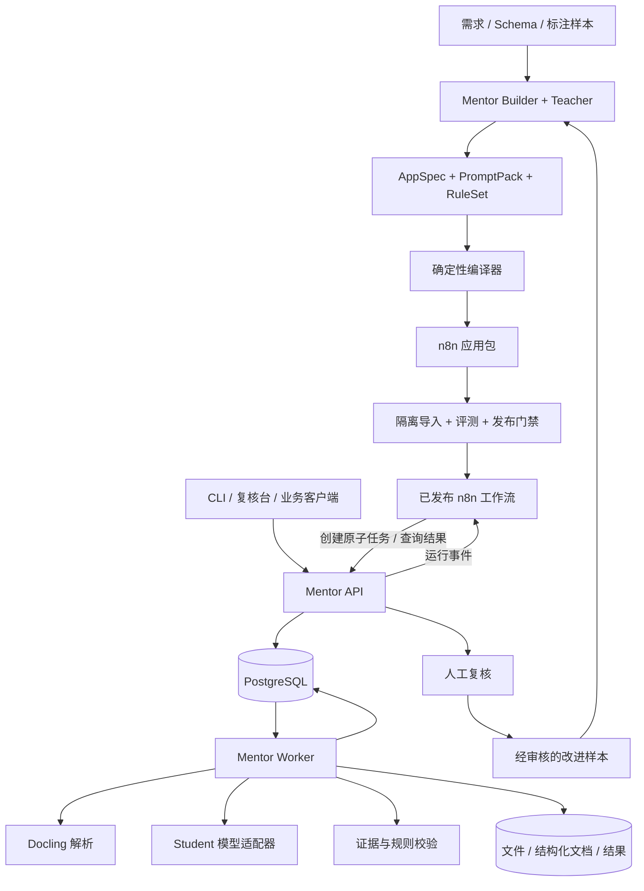

# Mentor

[简体中文](README.md) | [English](README.en.md)

**用强模型设计和改进应用，用低成本模型稳定执行应用。**

Mentor 将业务需求、文档样本与验收规则转化为可验证、可部署、可持续优化的 AI 工作流。首个版本聚焦**文档抽取与校验，优先采用 n8n + Docling**；后续通过独立适配器支持 Dify。

> 本文是后续实现的技术基线，更新于 2026-09-20。当前仓库仅有方案和许可证，下面的模块、目录、接口、命令与性能指标均为规划，尚未实现或实测。开发时按里程碑逐项交付，并将实际支持范围、版本和运行方式更新到本文。

阅读导航：[产品范围](#1-产品目标与首版边界) · [总体架构](#3-总体架构与职责) · [应用契约](#4-appspec可编译的应用契约) · [可靠执行](#7-n8n-集成与可靠执行) · [评测门槛](#9-评测成本与发布门槛) · [接口设计](#10-数据模型与-api-契约) · [实施计划](#15-实施里程碑与完成定义)。

## 1. 产品目标与首版边界

### 1.1 要解决的问题

直接让模型读取整份文件并返回 JSON，往往无法同时保证准确率、成本、证据可追溯和故障恢复。Mentor 把任务拆为可验证的步骤：解析文档、定位相关内容、抽取字段、验证证据、执行业务规则、处理异常，再把经评测验证的配置固化为应用版本。

“强”和“弱”表示模型在具体任务上的能力及成本角色，由评测决定，不按参数量或品牌预先定性。强模型称为 **Teacher**，日常执行模型称为 **Student**。

### 1.2 首个标准应用：采购订单抽取与校验

选择采购订单作为参考模板，验证表头、明细表、金额关系和跨页证据；通用抽取能力通过 Schema 扩展到其他文档类型。

| 维度 | v0.1 范围 |
| --- | --- |
| 用户 | 单组织部署；开发者配置应用，操作人员上传和复核文档 |
| 输入 | 单份 PDF 或 PNG/JPEG；数字 PDF 优先，随后覆盖清晰的中文、英文扫描件 |
| 默认限制 | 每份最多 20 页、20 MiB；上限可配置，超限在入队前拒绝 |
| 表头 | 订单编号、订单日期、买方、卖方、币种、订单总额 |
| 明细 | 品名、数量、单位、单价、行金额；可选折扣、运费和税额 |
| 校验 | 类型、必填、证据位置、金额精度、行金额及合计关系、字段冲突 |
| 输出 | 业务 JSON、字段证据、规则报告、运行成本、复核状态；原始输出和修订记录可追溯 |
| 集成 | 标准 n8n 工作流 JSON，调用 Mentor Runtime 与 Docling 解析能力 |
| 人工操作 | 接受、修正、拒绝；可查看对应页和原文证据 |

首版不支持手写识别保证、任意格式通吃、跨文档对账、开放网页抓取、业务系统自动写回、多租户计费或自研拖拽画布。DOCX、复杂混排、文档问答和 Dify 放入后续版本。文档无法识别或规则不适用时返回明确状态，不能编造字段或把未检查当作通过。

### 1.3 用户闭环

1. 提供业务目标、字段定义、规则和少量脱敏样本。
2. Teacher 生成候选应用规格、抽取提示词、示例和规则建议，列出未决业务问题。
3. 用户确认字段含义、金额口径、缺失值处理和验收目标，形成不可变规格修订。
4. 编译器生成 n8n 工作流和运行配置，在隔离环境导入并执行评测。
5. 达到质量、成本和运行门槛后发布版本，Student 处理日常文档。
6. 难例进入人工复核；经审核的修正样本用于下一轮离线优化。

首版实现的是**提示词、示例、任务拆分与策略的优化**。模型微调和权重蒸馏仅作为后续选项，不作为首版依赖。

## 2. 核心架构决策

| 决策 | 方案 | 原因与约束 |
| --- | --- | --- |
| 首发平台 | n8n + Docling | 围绕文档处理和确定性业务分支完成一个可用闭环，再支持 Dify |
| 构建方式 | Teacher 输出受约束的 `AppSpec`，程序编译工作流 | 节点结构、变量引用和错误路径由代码保证，模型不能直接生成任意可执行代码 |
| 执行边界 | n8n 负责流程推进；Mentor 负责原子能力、领域状态和评测 | 保留可读的原生工作流，同时避免规则散落在平台表达式中 |
| 文档真源 | 原文件 + Docling JSON + Mentor 规范化文档 | Markdown 用于提示词和预览；证据和表格结构以结构化结果为准 |
| 质量优先级 | 硬规则和证据检查先行，模型评分辅助 | JSON 格式正确、模型自报高置信度都不能证明业务正确 |
| 模型策略 | 离线 Teacher，在线 Student；在线 Teacher 默认关闭 | 先量化 Student 的真实能力，再按预算启用难例升级 |
| 系统形态 | Python 模块化单体，API 与 Worker 分进程 | 共享类型和业务逻辑；解析负载隔离，不提前拆成大量微服务 |
| 首版持久化 | PostgreSQL + 本地持久卷 | 减少部署组件；存储接口预留 S3，多主机前再实现对象存储 |
| 任务处理 | PostgreSQL 持久任务表；n8n 使用普通执行模式 | Worker 只执行原子任务，不再实现第二套 DAG 引擎；首版不需要 Redis |
| 前端 | 轻量复核台，复用 n8n 画布 | 优先解决上传、证据查看、人工修订与运行查询 |
| 发布策略 | 不可变应用包、环境绑定、实际导入验证、版本回滚 | 文件生成成功不能等同于工作流能够运行 |

## 3. 总体架构与职责



### 3.1 控制面：设计、编译、评测、发布

- **Builder**：将需求和样本转为候选规格；记录假设、待确认事项与变化原因。
- **Spec Validator**：检查 Schema、任务图、规则参数、预算和目标平台能力。
- **Compiler / Target Adapter**：由已测试的模板生成平台产物，不做模型调用。
- **Evaluator / Optimizer**：执行固定数据集、归因失败、提出有限的候选改进。
- **Registry / Release**：保存不可变应用包、评测结果和环境绑定，管理当前发布指针。

已部署的应用不依赖 Builder、优化器或 Teacher 在线可用。

### 3.2 运行面：接入、原子任务、结果与复核

- **API**：身份认证、文件接入、应用版本选择、运行查询、任务接口、人工修订。
- **n8n**：执行已编译的业务图，决定先后顺序和分支，调用原子能力并等待任务完成。
- **Worker**：执行 `parse`、`extract`、`validate` 等任务；维护租约、重试次数和调用记录。
- **PostgreSQL**：业务状态的权威来源；n8n 自身使用独立数据库/用户，Mentor 不读写其内部表。
- **ArtifactStore**：保存原件、解析件、页图、评测产物及结果；n8n 仅传递 ID 和小型状态。

`Run.status` 描述文档处理结果，`n8n execution status` 描述平台执行结果。工作流成功结束后，业务结果仍可能是 `needs_review`；两者必须分别展示。

## 4. AppSpec：可编译的应用契约

### 4.1 契约内容

`AppSpec` 是业务语义的唯一来源，使用 YAML 编写，经 Pydantic 校验后序列化为规范 JSON。Schema 版本、业务应用版本、编译器版本和目标平台版本分别管理。

| 组成 | 必须表达的内容 |
| --- | --- |
| 身份 | `schema_version`、`app_id`、`app_version`、说明、修订来源 |
| 输入 | 文档格式、语言、大小/页数限制、文档类型 |
| 输出 | JSON Schema、字段解释、精度、归一化策略、缺失值语义 |
| 文档策略 | 解析配置、分块方式、证据定位、长表处理 |
| 模型策略 | 逻辑角色、能力需求、上下文和输出 token 预算、有限修复/升级策略 |
| 规则 | 规则 ID、类型、字段绑定、适用条件、参数、严重级别 |
| 流程 | 有类型的节点和边、终止条件、任务超时、错误路由 |
| 评测 | 数据集版本、指标定义、门槛、成本比较口径 |
| 部署 | 目标平台、兼容配置、所需连接名称，禁止包含凭据值 |

下面是**配置形态示意，并非已可执行的完整规格**；实际文件还需包含输出 Schema、PromptPack、规则定义和类型化任务图。

```yaml
schema_version: "0.1"
app_id: purchase_order_extractor
app_version: "0.1.0"
target: n8n
input:
  formats: [pdf, png, jpeg]
  languages: [zh, en]
  max_pages: 20
  max_file_bytes: 20971520
document:
  parser_profile: standard_ocr
  preserve_tables: true
  evidence_required: true
models:
  teacher: teacher_default
  student: student_default
policy:
  missing_value: null
  max_student_repairs_per_step: 1
  max_teacher_escalations_per_run: 0
  max_model_requests_per_run: 24
  max_run_seconds: 600
rules:
  - id: line_amount_consistency
    type: decimal_product_equals
    fields: [items.quantity, items.unit_price, items.line_amount]
    rounding: half_up
    tolerance_minor_units: 1
    severity: error
evaluation:
  dataset: purchase_orders_v1
  min_critical_field_accuracy: 0.98
  min_auto_accept_precision: 0.99
  max_review_rate: 0.20
```

### 4.2 首版支持的逻辑节点

逻辑图仅允许 `document.parse`、`document.select`、`llm.extract`、`rules.validate`、`quality.route`、`review.create`、`result.finalize`。数据处理主图为有向无环图；修复和等待采用模板内明确有界的子流程，不开放任意递归或动态工具选择。

每个节点声明输入输出类型、前置条件、超时和失败码。`llm.extract` 只能引用已登记 PromptPack、Schema 和模型角色；规则只能调用注册表中的确定性操作符；用户文本不能成为 Python、JavaScript、SQL 或 n8n 表达式代码。

### 4.3 编译链

```text
AppSpec + PromptPack + RuleSet
  -> 语法与类型校验
  -> 标准化执行计划（ExecutionPlan）
  -> 目标平台能力检查
  -> 模板展开与变量绑定
  -> n8n workflow.json + runtime-config.json + manifest.json
  -> 静态检查 -> 真实导入 -> 冒烟测试 -> 评测 -> 可发布应用包
```

ExecutionPlan 是编译中间表示，仅描述 Mentor 支持的语义，不尝试覆盖所有 n8n/Dify 功能。目标不支持某个节点时返回包含节点 ID、能力缺口和处理建议的错误，禁止静默删除或降级。

编译器必须检查唯一节点 ID、无悬空引用、类型兼容、所有分支可终止、模板表达式合法、最大调用量可约束、凭据占位符完整。固定输入、编译器与目标配置时，产物内容哈希相同；时间戳放在构建记录，不参与规范产物。

## 5. 文档解析、抽取与证据

### 5.1 接入和解析

1. 上传到 Mentor API，验证文件魔数、扩展名、字节数、页数和访问权限；加密 PDF、损坏文件、超限输入返回明确错误。
2. 原件写入 ArtifactStore，记录 SHA-256；同组织内允许复用内容，相同文件也可用不同应用版本重新执行。
3. Docling 在受限 Worker 中解析文档，保留文本、表格、阅读顺序以及可获得的页面和位置数据。
4. 同时保存完整 Docling JSON 与 Mentor `DocumentIR`；Markdown 是派生视图。Docling JSON 能保留表格跨度，Markdown 不具备同等表达能力，见[官方序列化说明](https://docling-project.github.io/docling/concepts/serialization/)。
5. 记录解析状态、页数、实际 OCR 引擎/语言、模型文件版本、耗时及页面异常。解析失败或部分页缺失不得作为完整文档继续自动接受。

PDF 优先利用文本层，必要时启用 OCR；扫描件使用经中英文样本验证的 OCR 配置。Docling 支持多种输入和可配置转换过程，但具体格式及 OCR 质量仍需由项目数据集验证，见[转换器参考](https://docling-project.github.io/docling/reference/document_converter/)。

### 5.2 DocumentIR 与证据契约

`DocumentIR` 包含 `document_id`、原件哈希、解析配置哈希、版本、页面、段落块、表格和解析警告。证据至少包含：

| 字段 | 约定 |
| --- | --- |
| `document_id` / `parse_id` | 固定到原件及本次解析版本，不能指向“最新解析” |
| `block_id` | 在同一解析版本内稳定；重新解析可能变化 |
| `page` | 从 1 开始；来源没有页码时为 `null`，不能伪造 |
| `bbox` | 可选，规范化为左上角原点、0–1 比例坐标；保留原始坐标与转换信息 |
| `text_span` | 文本块内 Unicode 码点偏移 `[start, end)`，服务端解析；前端不按 UTF-16 直接切片 |
| `table_cell` | 可选，表格 ID、从 0 开始的行列索引及跨度 |
| `quote` | 原文摘录；由服务端核验与定位结果一致 |

首版采购订单证据要求能定位到页面及文本块/单元格。缺失必要定位信息时转复核；不要求解析器在所有格式上提供同样的几何精度。

### 5.3 分块和抽取策略

- 先按标题、段落和表格建立结构块，再按 Student 的真实 tokenizer 及上下文预算分块，为提示词、Schema 和输出预留空间。
- 表头与明细采用不同的抽取步骤。明细表按行窗口处理，每个窗口重复列头，携带表格 ID、原始行号和来源块 ID。
- 跨页表只有在列结构和续表证据一致时才合并；无法确认时保留冲突。按来源位置去重，不能仅按“品名相同”删除合法重复行。
- 首版以规则和结构定位选择内容，未命中时在总预算内扫描剩余块；不引入向量数据库。超出预算或被截断必须返回不完整标记。
- Student 返回业务字段和证据引用；没有来源时输出 `null` 与原因，不能补写订单编号、币种、日期或金额。

每个应用记录归一化策略：日期歧义不猜测，币种不能只凭语言推断，金额使用十进制字符串与明确币种，小数位及舍入方式由规则指定。

### 5.4 结果格式

业务值与字段元数据分开，避免下游遍历复杂包装对象。以下为截断示例；完整 Schema 由应用定义。

```json
{
  "run_id": "run_example",
  "app_version": "0.1.0",
  "result_revision": 1,
  "status": "needs_review",
  "data": {
    "order_number": "PO-2026-001",
    "currency": null,
    "total_amount": "1280.00"
  },
  "field_meta": {
    "/total_amount": {
      "state": "extracted",
      "evidence": [{
        "document_id": "doc_example",
        "parse_id": "parse_example",
        "block_id": "block_42",
        "page": 2,
        "quote": "合计 1280.00"
      }]
    },
    "/currency": {
      "state": "not_found",
      "evidence": []
    }
  },
  "validation": [{
    "rule_id": "currency_required",
    "status": "fail",
    "field_paths": ["/currency"],
    "message": "未找到币种证据，需要人工复核"
  }]
}
```

`field_meta` 的键使用 JSON Pointer。字段状态包含 `extracted`、`not_found`、`unreadable`、`conflict`、`derived`、`human_corrected`；不得把缺失金额转换为零。计算字段记录 `rule_id` 和输入字段链；人工修正记录操作者、原因和修订版本，不伪装为模型原始证据。

## 6. 确定性校验与异常路由

### 6.1 四层校验

1. **结构校验**：JSON 可解析，满足 Schema，未知字段和不合法类型有明确处理；使用严格校验，不能隐式把任意字符串变为有效金额。
2. **证据校验**：引用属于当前文档/解析版本，原文可定位，归一化后的值与原文相符；存在引用只能证明可定位，字段语义是否正确还需规则和评测验证。
3. **业务校验**：字段必填、枚举、日期格式、十进制计算及业务约束。规则结果为 `pass`、`fail`、`not_applicable`、`unknown`。
4. **质量路由**：所有关键检查通过且文档完整时才自动接受；其他结果按原因转修复、复核或技术失败。

参考模板的行金额规则仅适用于已明确“数量 × 单价”的行；折扣、税费、运费和舍入口径必须在模板中定义。订单合计仅在所有相关项齐备时计算；不能为让等式成立而修改抽取值，未知计算口径返回 `unknown`。

### 6.2 有限恢复策略

| 问题 | 处理 | 上限与结束状态 |
| --- | --- | --- |
| 非法 JSON / 可修复格式 | 携带结构错误给 Student 修复 | 每抽取步骤最多 1 次；仍失败转 `needs_review` |
| 字段冲突 / 缺少关键证据 | 局部补充上下文后重抽，或直接复核 | 不重复发送整份文档；受全局调用预算限制 |
| OCR 不可读 / 解析不完整 | 保留诊断和可用页，转复核 | 不把文档结构问题归咎为提示词问题 |
| 模型 429 / 临时 5xx | 遵守 Retry-After，指数退避加抖动 | 每次逻辑调用最多 2 次传输重试；总截止时间优先 |
| 模型 401 / 参数不支持 | 返回配置错误 | 不重试，不自动改换其他数据出口 |
| Teacher 在线升级 | 仅显式启用的应用和允许外发的数据 | 默认 0；启用后每 run 最多 1 次，仍须通过同样校验 |
| 预算耗尽 | 停止新增调用，保存已有证据和诊断 | 有可审阅结果则 `needs_review`，否则 `failed` |

Student 修复次数、传输重试和 Teacher 升级统一计入 `max_model_requests_per_run`、token 预算及费用账本，避免多层重试相乘。每次外部请求前原子预留预算；并发请求也不能突破应用限额。供应商未返回用量时标记估算，不能按零成本计费。

首版不用模型自报的 0–1 置信度自动放行。后续若引入质量分数，须在独立验证集上校准，并且不能覆盖关键规则失败。

## 7. n8n 集成与可靠执行

### 7.1 标准工作流

n8n 支持工作流 JSON 导入导出；导出内容可能带有凭据名称、ID 或 HTTP 参数中的认证信息，因此 Mentor 必须独立检查并清理产物，见[官方导入导出说明](https://docs.n8n.io/build/manage-workflows/export-and-import)。

生成的画布应能看清实际业务步骤：

```text
Authenticated Webhook（接收 run_id、artifact_hash）
  -> 校验运行绑定
  -> 创建 parse 任务 -> 等待并查询
  -> 创建 select 任务 -> 等待并查询
  -> 创建 extract 任务 -> 等待并查询
  -> 创建 validate 任务 -> 等待并查询
  -> Switch（通过 / 有限修复 / 人工复核 / 技术失败）
  -> finalize 或 review.create
```

节点使用经过验证的 Webhook、HTTP Request、If/Switch、Wait 等原生类型，锁定 `typeVersion`。有限修复展开为模板分支；首版不依赖社区节点，不把全部业务流程藏进一个黑盒 HTTP 节点。

Docling 和模型调用以异步原子任务运行，API 立即返回 `task_id`。n8n 用 Wait + 查询循环等待结果：起始间隔 2 秒、逐步增加到最多 10 秒，每轮检查任务状态及 run 截止时间。轮询和传输重试属于模板实现，不允许无限等待。

生产入口使用已发布工作流的生产 Webhook，测试入口只用于隔离验证；两者不能混用。相关行为见[n8n Webhook 文档](https://docs.n8n.io/integrations/builtin/core-nodes/n8n-nodes-base.webhook/)。外部调用者通过 Mentor API 上传文件及创建 run，API 落库后返回 `202`，不等待整份文档处理完成。

### 7.2 幂等、任务租约和恢复

- 创建 run 的事务同时写入 outbox 事件；派发器重试投递到 n8n，保证“已接收”的任务不会因提交后进程崩溃而遗失。
- 客户端幂等键按组织、接口和请求体哈希绑定；相同键及内容返回已有资源，相同键不同内容返回 `409`。
- 原子任务以 `(run_id, logical_step_id, repair_round, input_hash)` 去重；重复 Webhook 可以重新经过画布，但已完成任务返回已有产物。
- Worker 使用 PostgreSQL `FOR UPDATE SKIP LOCKED` 短事务领取任务，执行期间不持有数据库事务；保存租约、心跳和单调递增 fencing token。
- 任务产物以 attempt 为单位写入；只有持有当前租约和 fencing token 的 Worker 可以提交任务结果，阻止过期进程覆盖新结果。
- Worker 崩溃后租约到期可重新领取。供应商超时可能已经产生费用，不能承诺外部推理恰好一次；所有已知和不确定调用均保留账本。
- Worker 只执行请求指定的原子步骤；步骤合法性及前置产物由 API 验证。n8n 负责决定下一步，任务表不负责调度业务图。
- Watchdog 识别停止心跳、超过截止时间或派发后未启动的 run；在限次范围重投入口，从已有原子产物恢复，否则结束为带原因的 `failed`。
- 取消操作持久化标志，停止后续排队和模型调用；无法即时撤销的外部请求可能继续计费，其迟到结果不能把 run 改回成功。

文件先写临时位置并原子提交，再创建有效数据库引用；异常遗留文件由带保留期的清理任务回收。run 最终结果、状态变更与审计事件在同一事务写入。

解析缓存键包括组织、原件哈希、解析配置、Docling/OCR 版本与模型资源哈希。模型缓存还需包括规范输入、PromptPack/Schema 哈希、实际模型 ID 和生成参数；无法确认模型版本稳定时禁用长期复用。缓存不能跨越权限边界，重复命中也要记录来源和零新增调用事实。

### 7.3 人工复核和终态

```text
queued -> running -> succeeded
                  -> needs_review -> succeeded / rejected
                  -> failed
queued / running / needs_review -> cancelled
```

`running` 的具体阶段保存在 `current_step`，不继续扩张 run 状态枚举。进入 `needs_review` 后，当前 n8n execution 正常结束，复核队列由 Mentor 持久化，避免为数天的人工作业保留轮询。

复核提交带 `expected_result_revision`；并发修订不匹配返回 `409`。修改后重新执行相关确定性规则，关键失败不能直接放行。确实需要例外时由管理员记录独立的 override 决策和原因，结果标记人工接受；该记录不计入自动接受精度。原始模型结果保留，最终结果追加新版本。

`failed`、`rejected`、`cancelled` 的重跑创建新 run 并关联原 run；发布切换不改变已开始 run 的版本绑定。首版交付结果查询/下载，外部系统写回留到后续通过 outbox 和幂等连接器实现。

创建复核项和最终提交同样受数据库唯一约束与状态转换保护；重复执行结束节点返回已有结果，不能生成多张复核单或重复追加结果修订。

## 8. Teacher 设计与离线优化

### 8.1 构建输入和产物

Builder 接收业务说明、人工定义的字段/规则约束、脱敏文档摘要以及开发集样本。Teacher 只可输出约束 Schema 内的候选规格、PromptPack、示例选择和解释；不能修改认证、数据外发策略、测试集、发布门槛或运行预算上限。

输出必须说明字段含义、可能歧义和未决业务口径。涉及币种来源、总额组成等问题没有确定答案时，保留显式待确认项；待确认的关键项阻止发布。

### 8.2 有界优化循环

1. 在固定开发集上运行当前 Student 应用，按字段、语言、模板、扫描质量聚合错误。
2. 区分解析/定位错误、漏抽、误抽、类型错误、业务规则错误和基础设施错误；解析问题不能只靠改提示词处理。
3. Teacher 提议局部变更：字段描述、少样本、表格窗口、上下文选择或规则建议；每个变更保存前后 diff 和来源样本 ID。
4. 候选先通过编译检查，再在开发集调试，在验证集选优；固定预算内最多 3 轮、每轮最多 3 个候选。
5. 优先满足质量门槛，再比较成本和延迟；质量达标候选保留成本—质量对比，不用单一加权分数掩盖关键错误。
6. 发布候选冻结后，由独立评测入口在锁定测试集上执行一次验收。测试失败则拒绝发布；反复根据同一测试集改进后，该测试集必须退役为开发数据并补充新的独立测试集。

Teacher 生成的标签属于候选标注，不能直接充当测试真值。在线复核结果也需要审核、脱敏、去重和数据集版本登记后才进入下一轮；不允许自动改写生产提示词。

## 9. 评测、成本与发布门槛

### 9.1 数据集建设

M0 先收集至少 30 份有代表性的脱敏样本用于可行性评估。v0.1 验收前建立至少 500 份文档的人工校验数据集，建议开发集 200、验证集 100、锁定测试集 200。

以供应商/版式家族为分组单元划分，原件、扫描变体、相近模板和同源合成样本不得跨集合泄漏。数据集清单记录内容哈希、文档族、语言、扫描属性、字段值、证据、预期规则和人工复核需求。主要目标场景都要出现在测试切片中；样本不足的切片只能报告探索结果。

测试真值由人工确认，关键金额/编号及存在争议的证据需复核仲裁。合成数据可补充边界情况，单独标记和报告，不能代替真实文档指标。

### 9.2 三条对照路径

| 路径 | 用途 |
| --- | --- |
| 相同解析/抽取流程全部使用 Teacher | 建立高能力模型参考质量和成本，不视为绝对真值 |
| 未经优化的 Student | 测量起点，确认 Teacher 优化是否带来收益 |
| Mentor 优化后的 Student + 既定恢复策略 | 验证最终应用，重试、升级和失败均纳入统计 |

三组使用相同文件、Schema、规则、评测器及预先固定的请求配置。分别报告缓存关闭的冷运行和启用缓存的运行；不能用大量缓存命中与全价基线比较。固定参数仍不能保证模型输出完全一致，关键候选须报告重复运行波动。

Teacher 优化收益还须相对“未经优化的 Student”单独报告：在关键质量不退步的前提下，至少改善预先选定的准确率、自动接受覆盖率或单份总交付成本之一。若改善落在重复运行波动范围内，只能标记收益未证实，不能用与 Teacher 的价格差替代优化效果。

### 9.3 指标定义与初始目标

下表是拟定的 v0.1 发布目标，**不是现有性能承诺**。M0 根据代表性样本确认可行性，M1 前冻结数据口径和门槛；后续变更必须记录原因、影响及新基线，不能在看到测试结果后临时降低标准。

| 指标 | 定义 | 初始目标 |
| --- | --- | --- |
| Schema 合法率 | 所有产生结果的 run 中，最终 JSON 满足 Schema 的比例；另报原始首次输出合法率 | 最终 100% |
| 关键字段准确率 | 所有输入的关键字段按确定的归一化规则精确匹配；失败或未产出按错误计 | ≥ 98% |
| 明细字段质量 | 按人工行对齐后计算字段 micro-F1；重复行、漏行和多行均计错 | ≥ 95% |
| 自动接受精度 | 自动接受文档中，关键字段、关键明细及关键规则全部正确的比例 | ≥ 99% |
| 自动接受覆盖率 | 自动接受数量 / 全部符合输入范围的测试文档数 | ≥ 80% |
| 人工复核率 | 首次进入 `needs_review` 的文档数 / 全部符合范围的文档数 | ≤ 20% |
| 关键证据有效率 | 自动接受结果中，关键字段证据可定位且经标注验证支持字段值的比例 | 100% |
| 技术失败率 | 非业务拒绝的 `failed` 数 / 合法提交数，在模型服务正常的受控环境下测量 | ≤ 1% |
| 平均模型费用 | 最终路径的所有模型费用 / 提交文档数，与 Teacher 路径同口径比较 | ≤ Teacher 基线的 50% |
| 数字 PDF 时延 | 1–10 页、并发 2、模型和解析器已预热，提交至自动结果/复核队列的 p95 | ≤ 180 秒 |
| 扫描 PDF 时延 | 相同口径，单独统计 OCR | ≤ 300 秒 |

准确率同时报告整体和语言、文档族、扫描类型切片；缺失值大量存在时另报“来源有值字段”的准确率，避免空值掩盖漏抽。自动接受精度按文档级判定，不能用容易字段的平均分替代；误接受关键规则故意失败的测试样本直接阻止发布。

所有比例展示分子/分母；精度、准确率附 95% 置信区间。200 份测试集只用于首版经验验收，不足以证明生产精度下界达到 99%。上线试点对自动接受结果持续人工抽样，任何确认的关键误接受暂停该应用自动放行，回滚或切换为全量复核。

时延测试记录实际 CPU、内存、OCR 配置、模型 ID、区域、并发、文档页数/分辨率及冷启动时间；人工等待时间另计。基础参考环境为 Linux 容器、8 vCPU、16 GiB 内存和外部模型 API，资源需求以 M0 实测为准。

### 9.4 成本账本

```text
单份运行成本 = 文档解析成本 + 全部模型请求成本 + 存储与运行资源分摊
单份总交付成本 = 单份运行成本 + 人工复核成本 + 构建/优化成本摊销
构建回本量 = 额外构建成本 /（基线单份总交付成本 - 优化后单份总交付成本）
```

回本公式仅在分母大于零且业务口径相同时使用。模型费用按输入、输出、缓存 token 和供应商实际价格快照记录；自托管模型计入 GPU 时间及利用率假设。Teacher 设计费、评测费和人工复核时间独立展示，不能仅凭便宜模型的 token 单价宣称整体降本。

## 10. 数据模型与 API 契约

### 10.1 核心实体

| 实体 | 关键内容 |
| --- | --- |
| `Application` / `AppRevision` | 逻辑应用、不可变 AppSpec、PromptPack、RuleSet、内容哈希 |
| `Build` / `Artifact` | 规格修订、编译器与目标版本、应用包哈希、静态检查报告 |
| `DatasetVersion` / `Evaluation` | 数据集清单、划分、模型配置、指标、原始结果、费用 |
| `Deployment` | 环境、应用包、n8n 工作流 ID、连接绑定、发布与回滚记录 |
| `Document` / `Parse` | 原件、所属组织、哈希、解析配置、DocumentIR 和页图引用 |
| `Run` / `StepTask` / `Attempt` | 固定版本、状态、截止时间、幂等键、租约、fencing token、诊断 |
| `ModelCall` | 模型角色/实际 ID、用量、价格快照、预留预算、估算/实际状态 |
| `ResultRevision` / `Review` | 原始与修订结果、字段变化、复核结论、操作者和原因 |
| `OutboxEvent` / `AuditEvent` | 持久派发状态、配置/状态/权限操作审计 |

首版单组织，每个业务实体仍显式绑定 `organization_id` 并在服务端检查访问范围。应用版本、结果版本不可原位覆盖；时间存 UTC，展示时转换时区。二进制原件及大量解析内容不放进数据库 JSON 字段。

### 10.2 对外 API（规划）

| 方法与路径 | 行为 |
| --- | --- |
| `POST /v1/documents` | multipart 上传并校验，成功返回 `201` 和 `document_id` |
| `POST /v1/apps` | 创建逻辑应用 |
| `POST /v1/apps/{app_id}/revisions` | 提交并校验 AppSpec，生成不可变修订 |
| `POST /v1/builds` | 根据修订和目标配置异步编译，返回 `202` |
| `POST /v1/evaluations` | 在指定数据集版本和候选应用包上异步评测 |
| `POST /v1/deployments` | 为已通过门禁的应用包创建环境绑定和发布记录 |
| `POST /v1/runs` | 指定 `document_id`、`deployment_id`；落库时固定版本并返回 `202` |
| `GET /v1/runs/{run_id}` | 返回状态、步骤、费用摘要和结果引用 |
| `GET /v1/runs/{run_id}/result` | 返回确定的结果修订；未就绪返回 `409 RESULT_NOT_READY` |
| `POST /v1/runs/{run_id}/cancel` | 请求取消，返回取消状态 |
| `GET /v1/reviews` | 游标分页获取待复核项 |
| `POST /v1/reviews/{review_id}/decisions` | 提交修订和决定，要求预期结果版本 |

Build、Evaluation、Deployment 均提供相应的按 ID 查询接口；文档和结果产物通过鉴权下载接口读取。列表支持游标分页和状态过滤。

内部接口使用独立服务身份：`POST /internal/v1/runs/{run_id}/steps/{step_id}/tasks` 创建步骤任务，`GET /internal/v1/tasks/{task_id}` 查询，结束节点提交 finalize/review 请求。服务端根据固定 ExecutionPlan 推导真实输入和允许的操作，不能信任调用方任意提交的提示词、URL、模型 ID 或步骤顺序。

统一错误格式为 `{"error":{"code":"...","message":"...","retryable":false,"trace_id":"..."}}`。明确区分 `400` 请求无效、`401/403` 身份/权限、`409` 状态冲突、`413` 超限、`422` 规格或文件不可处理、`429` 容量限制、`503` 基础服务不可用。拒绝请求前后是否创建资源须在 OpenAPI 中固定。

文件完成上传并成功提交元数据后才可创建 run；容量不足的请求在创建前返回 `429`。所有产生持久副作用的创建接口支持 `Idempotency-Key`，长任务不依赖单个 HTTP 连接存活。

## 11. 技术栈、配置与部署

### 11.1 选型

| 层 | 首版选择 | 约束 |
| --- | --- | --- |
| Python 工程 | Python 3.12、uv、pyproject.toml | 用锁文件复现依赖，CI 与容器使用一致环境 |
| API / 数据契约 | FastAPI、Pydantic v2、JSON Schema | Pydantic 定义为 API Schema 来源；业务规则独立实现 |
| 数据访问 | PostgreSQL、SQLAlchemy 2、Alembic | 事务、唯一约束、迁移和租约；不用 SQLite 代替并发集成验证 |
| 文档 | Docling + 已验证 OCR 后端 | 固定库版本、模型资源与解析配置，隔离 CPU/内存负载 |
| 模型 | 轻量 ProviderAdapter + HTTP 客户端 | 首版接通一组 Teacher/Student；厂商协议和结构化输出能力显式探测 |
| 工作流 | n8n 自托管固定版本 | 初期普通模式，原生节点和标准 JSON |
| 复核台 | React、TypeScript、Vite、PDF.js | 上传、运行详情、页图/证据定位、字段修订；不做自定义画布 |
| 校验与测试 | pytest、Ruff、mypy；前端类型检查和关键浏览器测试 | 优先验证金额、证据、幂等、故障恢复、兼容性 |
| 可观测性 | 结构化日志 + OpenTelemetry 埋点 | 日志默认不含原文；监控后端按部署需要接入 |
| 部署 | Docker Compose、Linux 容器 | Windows 开发通过 Docker Desktop / WSL2 运行同一套服务 |

以上是选型边界，不代表已验证完整版本组合。M0 必须记录实际 n8n 版本/镜像 digest、Docling/OCR 版本和模型资源哈希、Python/PostgreSQL 版本、模型供应商与模型 ID；M1 提交锁文件和兼容配置。禁止使用 `latest` 标签作为发布基线。

模型适配器统一提供 `generate_structured(request) -> response + usage`，但不假设所有供应商的兼容接口、JSON Schema、超时和 token 计算完全相同。模型配置包含最大上下文、结构化输出支持、价格来源、请求超时、并发上限和允许的数据分类。测试环境使用假模型，质量评测显式调用真实模型。

### 11.2 部署轮廓

首版 Compose 包括 `mentor-api`、`mentor-worker`、`n8n` 和 `postgres`；复核台静态文件由 API 或入口代理提供。解析 Worker 可由同一镜像单独运行并设置资源上限。原件和解析产物在 API/Worker 共享持久卷中，n8n 无须挂载文档卷。

初始并发为解析 1、模型请求 2；通过压测再提高。数据库、内部任务接口及 Worker 不对公网暴露。离线模型资源预下载并校验，Worker 就绪检查确认 OCR 模型已加载；首次下载和冷启动单独记录，不能误报服务已就绪。

多主机扩展时先把 ArtifactStore 切换到 S3，再增加 Worker。确有 n8n 吞吐瓶颈时启用 queue mode 与 Redis；n8n 官方定义了相应执行架构和存储约束，见[队列模式文档](https://docs.n8n.io/deploy/host-n8n/configure-n8n/scaling/enable-queue-mode)。Mentor 的文档仍保存在自身 ArtifactStore，不依赖 n8n 付费外部二进制存储功能。

### 11.3 配置与凭据

环境配置包括数据库连接、存储根目录、n8n URL、模型端点、角色映射、并发、预算、文档保留期和身份配置。连接使用逻辑名称，如 `student_default`、`teacher_default`、`mentor_runtime`，部署时解析成真实值。

开发环境使用不入库的 `.env` 或本地 secret 文件；部署使用环境注入/挂载 secret。模型密钥仅供 Runtime/Builder 使用，n8n 只持有调用 Mentor 的服务凭据。应用包中保留连接需求和参数名称，不能包含密钥、用户数据、固定的本地绝对路径或调试样本。

## 12. 数据保护与运行可观测性

文档属于不可信输入：其中的指令只作为待抽取数据，不影响系统提示词、规则、工具权限或外发目的地。Teacher 和 Student 都不能执行文档中的命令或访问文档提供的任意 URL；文件下载只经由受控存储，供应商端点由管理员配置并限制网络出口。

API 使用组织内身份和角色：管理员管理连接/发布，操作员运行应用，复核员修改结果。首版可以使用受保护的部署入口和 API token，复核操作必须可归属到具体用户；生产不启用匿名管理接口。上传文件在限资源进程中解析，预览进行安全转义，不加载文档内脚本和远程资源。

记录 `trace_id`、`run_id`、逻辑步骤、task/attempt、应用包哈希和 n8n execution ID，串联控制面与运行面。仪表盘至少包括队列深度、最老任务等待时间、租约过期数、技术失败率、解析失败率、复核率、模型错误/429、费用和时延分位数。n8n 执行数据仅保留 ID 和状态摘要，默认禁止保存完整提示词、原文和密钥。

默认业务文件及解析/结果产物保留 30 天，脱敏操作审计保留 90 天，均可按部署策略调整。删除原件时按引用关系清理解析件、页图、缓存、结果和授权样本副本；运行中的引用先取消或等待结束。备份的保留和恢复后删除重放同样纳入生命周期，不能只删除在线文件。

备份涵盖 Mentor 数据库、产物卷、n8n 数据库和凭据加密密钥，密钥备份与数据分开控制访问。试点上线前验证一次完整恢复；初始目标为每日备份、RPO 24 小时、RTO 4 小时，只有恢复演练达标后才能承诺。

## 13. 应用包、版本与平台扩展

### 13.1 交付包

```text
purchase-order-extractor-0.1.0/
  app-spec.yaml
  execution-plan.json
  runtime-config.json
  workflow.n8n.json
  prompts/
  schemas/
  rules/
  manifest.json
  evaluation-summary.json
  connections.example.yaml
  DEPLOY.md
```

`manifest.json` 记录运行配置、工作流、提示词、Schema 和规则的文件哈希，以及规格/编译器/目标版本、节点类型版本、依赖和模型角色。对这份规范化清单计算 `build_digest`，不在清单中递归包含自身哈希；本文的应用包哈希均指该运行内容摘要。

评测报告、构建时间和部署绑定是关联 `build_digest` 的外部记录；`evaluation-summary.json` 是这些记录的随包副本，不参与运行内容摘要，避免评测后重新打包改变被验证对象。分发压缩包另有完整文件校验和。原始评测样本和完整结果保存在受控存储。

包可复制到独立部署环境，绑定连接后运行；它依赖指定版本的 Mentor Runtime，不宣称只有 n8n JSON 就能独立完成文档处理。部署时验证运行内容摘要、Runtime 兼容性、模型角色的实际绑定及评测记录；更换 Student 型号或生成参数后必须重新评测，不能继承旧模型的质量结论。

### 13.2 发布和回滚

发布步骤为：静态检查 → 目标实例导入 → 绑定测试连接 → 冒烟与评测 → 生成发布记录 → 切换部署指针。导入和绑定尚未完成的产物只能标记 `built`，不能标记 `deployable`。

每个已发布版本对应独立的工作流和固定 Runtime 配置。新 run 从部署指针解析到固定应用包，旧 run 继续使用旧版；回滚只切换新 run 的路由，不篡改历史记录。画布人工修改视为漂移：禁止自动覆盖，应导出为待审核的新候选或恢复已知应用包。

n8n 自动导入适配器采用公开工作流 API，并按锁定版本区分“导出文件形态”和“创建请求允许字段”，去除只读字段。API 能力以目标版本核验，见[官方工作流 API](https://docs.n8n.io/connect/n8n-api/workflow)。不假设所有部署提供相同的付费功能，也不依赖内部数据库或未验证接口。

### 13.3 Dify 与后续扩展

Dify 在 v0.2 以独立目标适配器接入，共享 AppSpec、解析、规则、模型记录及评测器。第一步输出可导入 DSL 并完成真实执行测试，不承诺任意 n8n 工作流可以无损转换。

Dify DSL 包含应用配置、工作流与提示词等信息，但知识库内容和部分环境依赖需要另行处理；Secret 环境变量也需明确排除，见[Dify 应用管理文档](https://docs.dify.ai/en/cloud/use-dify/workspace/app-management)。Dify 的长任务或人工复核能力若不能满足相同语义，适配器必须明确报不支持，或交付注明边界的异步提交/查询应用，不能把“提交成功”包装为“抽取完成”。

文档问答另立模板和评测集，再引入检索、索引、重排与引用检查。微调仅在积累足够合法可用的标注数据、提示词优化达到瓶颈且收益可测时进入实验阶段。

Mentor 自身使用 MIT 许可证；集成组件保留各自许可。首版按组织内部自托管场景设计；若未来提供托管工作流编辑器或对外销售 n8n 能力，需要重新核实对应商业授权边界，见[n8n 许可说明](https://docs.n8n.io/n8n-community-license/sustainable-use-license.md)。

## 14. 计划目录与开发约束

```text
Mentor/
  README.md
  README.en.md
  LICENSE
  pyproject.toml
  uv.lock
  src/mentor/
    api/                   # 公共 API、内部任务接口、身份与错误映射
    domain/                # 规格、文档、运行、复核等领域类型和状态转换
    builder/               # Teacher 需求规范化与候选生成
    compiler/              # 标准化计划、类型检查、模板展开
    adapters/n8n/          # 节点模板、导入、绑定、能力检查
    adapters/dify/         # v0.2 才实现
    documents/             # Docling 封装、DocumentIR、证据与表格分块
    models/                # ProviderAdapter、角色能力、用量和预算
    rules/                 # 注册式确定性校验、Decimal 计算
    runtime/               # 原子任务、Worker、租约、outbox、恢复
    evaluation/            # 数据集加载、评测、对照与统计
    optimization/          # 有界搜索、错误归因、候选比较
    storage/               # 数据库和 ArtifactStore
    cli/                   # 构建、运行、评测和运维命令
  web/                     # 轻量复核台
  migrations/
  templates/purchase-order/
  schemas/                 # 从领域类型生成的公开契约
  compatibility/           # 精确版本组合、节点能力和导入夹具
  tests/
    unit/
    integration/
    contracts/
    e2e/
    fixtures/              # 小型、脱敏、可再分发的测试样本
  evals/                   # 数据集清单/说明；原件不默认入库
  deploy/                  # Compose、容器、环境示例和启动检查
  docs/adr/                # 架构变更决策及迁移说明
```

模块按交付需要创建，不提前堆积空目录。领域逻辑不得依赖 n8n/Dify 数据结构；适配器依赖领域契约。提示词、Schema、规则和参考模板都纳入版本控制，生产修改必须产生新版本。

CI 分为三层：每次变更运行静态检查和假模型测试；兼容性变更运行锁定 n8n 容器的真实导入/执行；发布候选运行授权且有预算的真实模型评测。Fork PR 不获得模型密钥。测试不能仅比较导出 JSON 快照，还要验证语义、实际运行和异常恢复。

未来 CLI 计划提供 `mentor spec validate`、`mentor build`、`mentor evaluate`、`mentor run`、`mentor review` 等能力。当前尚不能执行；M1 实现后补充经过实测的安装和快速开始命令。

## 15. 实施里程碑与完成定义

按阶段验收推进，不按“代码写完”判断完成。前一阶段通过后再扩大范围；每阶段提交可重复的演示输入、运行记录和明确限制。

| 阶段 | 交付内容 | 完成标准 |
| --- | --- | --- |
| **M0：可行性与兼容基线** | 30 份样本、采购订单字段/金额口径、Docling 解析实验、Teacher/Student 对照、n8n 最小导入实验、版本矩阵 | 数字/扫描文件证据可定位；明确困难样本和资源消耗；固定首发模型组合、OCR 配置、字段与验收口径 |
| **M1：可重复的原子能力** | Python 工程、领域契约、数据库迁移、ArtifactStore、API/Worker、解析/抽取/校验、假模型、CLI 原子调试 | 单份数字 PDF 得到 JSON、证据及规则报告；缺失/冲突不能误接受；Worker 重启可恢复任务，费用和错误可查询 |
| **M2：n8n 端到端闭环** | 参考 AppSpec、确定性编译器、原生工作流、导入/绑定、outbox、有限重试、运行状态、复核 API | 空白目标实例能导入并运行；重复提交不重复产出；扫描件可用；故障后恢复到正确终态；CLI 能提交人工修订 |
| **M3：Teacher 构建与优化** | 需求到候选规格、PromptPack、错误归因、有界候选优化、三组基线、隔离数据集与成本报告 | 业务约束可人工确认；固定规格可重复编译；Student 达到冻结门槛并证明优化收益；测试数据不进入优化输入 |
| **M4：v0.1 试点交付** | 复核台、角色权限、发布/回滚、监控、备份恢复、部署说明和完整验收数据集 | 从需求和样本到发布再到人工修订全链路可操作；200 份锁定测试报告齐全；质量/成本门禁通过；完成恢复演练 |
| **M5：v0.2 扩展** | Dify DSL 适配、第二种文档模板、对象存储及按需扩容 | 每个新目标/模板有独立兼容与评测报告，不改变已有应用语义 |

M2 是首个可试用的文档应用；M4 才是具备 Mentor“强模型设计与优化”完整能力的 v0.1。若 Teacher 优化后仍无法满足目标，不强行发布：分析瓶颈，选择更合适的 Student、收窄文档范围或提高复核比例，并通过显式规格变更重建基线。

### v0.1 必须通过的验收场景

- 正常数字 PDF、清晰中英文扫描件、跨页明细表：结果可定位到正确来源，汇总金额遵守模板口径。
- 缺币种、日期歧义、金额冲突、重复品名、合并单元格、部分页不可读：输出明确状态，不生成伪造值或错误合并。
- 非法 JSON、超长模型输出、上下文不足、模型 429/5xx/401：策略有界，费用完整，终态正确。
- 同一幂等键重复上传/创建、重复 Webhook、Worker 在外部调用后崩溃：不覆盖已提交结果，保留可能重复调用的成本记录。
- API 落库后派发失败、n8n 重启、任务租约过期、旧 Worker 迟到、run 取消：能够恢复或明确失败，不能永久停在处理中。
- 并发人工修订、关键规则失败后接受、未授权查看/修改：版本和权限检查生效，审计可追溯。
- 文档中的提示词注入、伪造证据 ID、危险文件链接：不能影响执行权限、跳过规则或访问未授权资源。
- 全新实例导入、缺失凭据、目标节点版本不匹配、画布漂移、发布后回滚：能诊断问题，旧 run 保持固定版本。
- 数据删除、备份恢复、无 Teacher 运行：生命周期完整，已发布应用可继续执行。

## 16. 首轮实现顺序

第一批开发任务按依赖顺序推进：

1. 冻结采购订单字段定义、规则适用条件、输出/证据 Schema，并准备脱敏样本及标注规范。
2. 验证 Docling 的中文 OCR、跨页表格和证据定位，确定兼容版本与模型资源。
3. 建立单份文档的 Teacher/Student 对照，确认质量、延迟和费用是否具备可行性。
4. 用固定的手写参考规格验证 n8n 导入、异步任务查询和服务凭据绑定。
5. 实现持久化原子任务与校验后，再将参考规格接到确定性编译器。
6. 端到端执行和评测可信后，接入 Teacher 生成与优化，最后补齐复核台和发布运维。

后续重大调整应新增 ADR，记录问题、备选方案、最终选择、验证证据和迁移影响，并同步更新本文。具体模型 ID、依赖版本、部署参数和实测指标由 M0/M1 填入，不用猜测值冒充已经验证的配置。
